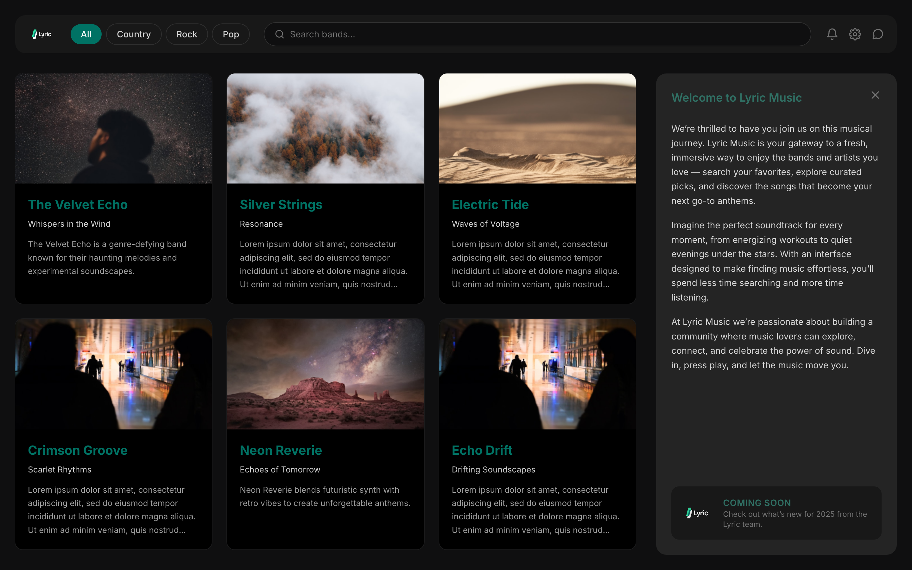

# Lyric Band Explorer

A two-pane band explorer SPA built for the Lyric take-home. Bands load
dynamically from mock JSON, with real-time search, genre filtering, a static
welcome panel, and a collapse-to-expand stretch goal — styled to the provided
design comp.

**Live repo:** https://github.com/drhamilton/lyric-band-explorer



---

## Quick start

```bash
cd app
npm install
npm run dev        # http://localhost:5173
```

Other scripts:

```bash
npm test           # run the Vitest suite
npm run typecheck  # tsc --noEmit
npm run build      # typecheck + production build to app/dist
npm run preview    # serve the production build
```

Requires Node 18+ (developed on Node 24).

---

## What it does

- **Dynamic band list** — fetched from `mock_data/bands.json`; each card shows the
  band name, album, cover image, and a description.
- **Cover images** — matched to each band's id, with `default.png` as a fallback.
- **Per-band detail** — fetched from `mock_data/<id>.json`, falling back to default
  text when a band has no detail file (only `001` and `005` ship one).
- **Search** — filters bands by name in real time (case-insensitive, partial).
- **Genre filters** — `All / Country / Rock / Pop` pills; combine with search (AND).
- **Welcome panel** — static copy on the right; close it (`×`) to expand the grid
  (the stretch goal). Pinned to viewport height so it doesn't track the results.
- **Selection, empty, and error states** — click a card to select it (indigo
  border); a clear empty state when nothing matches; a graceful inline error if
  the band list fails to load.

---

## Architecture

Small, deliberately shallow structure with the interesting logic behind one seam.

```
app/src/
  lib/
    bands.ts       # loadBands, fetchBandDetail (fallback), deriveVisibleBands (pure filter)
    images.ts      # coverImageUrl — the id → filename rule
  hooks/
    useBands.ts    # React async lifecycle over the data layer (loading/ready/error)
  components/
    TopBar, Logo, GenreFilter, SearchBox, IconBar,
    BandGrid, BandCard, WelcomePanel, ErrorState
  App.tsx          # holds UI state (query, genre, selection, panel) + composition
  types.ts         # Band, BandSummary, Genre, GenreFilter, LoadStatus
```

**The one seam.** All non-trivial logic — data fetching, the image-name rule, the
detail fallback, and the search∩genre filtering — lives in `lib/` as pure,
UI-free functions. `deriveVisibleBands({ bands, query, genre })` is the heart of
the filtering and is unit-tested directly, without the DOM. Components stay thin
and are covered by a few behavior tests (search narrows the grid, `×` collapses
the panel, a card selects, the error state renders).

### Two details worth calling out

1. **The image-name rule isn't what the brief implies.** The instructions say
   `id 001 → im001.png`, but the real asset set is `im001, im002, im003, im005,
   im008, im0010, im0012` — i.e. the filename is `im00` + the *integer* value of
   the id, not the zero-padded string. So `010 → im0010.png` and `012 →
   im0012.png` (a naive `im${id}.png` silently breaks those two). See
   `coverImageUrl` and its tests.
2. **Graceful degradation is layered.** A failure of the top-level `bands.json`
   surfaces the inline error state; a missing per-band detail file falls back to
   default text; a missing/broken cover image falls back to `default.png` via the
   `` `onError`. One broken asset never blanks the whole grid.

---

## Tech choices

- **React + TypeScript + Vite** — instructions preferred React; Vite is a fast,
  low-ceremony SPA baseline; TypeScript for a typed data layer.
- **Tailwind CSS v4** — utility-first styling; the design palette is sampled from
  the comp and declared as theme tokens in `src/index.css`.
- **react-icons** — the top-bar icon set.
- **Inter**, self-hosted via `@fontsource` (no external CDN).
- **Vitest + React Testing Library** — 25 tests across the data layer and
  component behavior.

The mock data and source images are served over HTTP from `app/public/` (copied
from `reference/`, which is kept untouched as the assignment's source of truth).

> Note: `npm audit` reports advisories on Vite/Vitest's transitive `esbuild` dev
> dependency (dev-server only, not shipped). `esbuild` is pinned to a patched
> `0.25.x` via `overrides`; the residual flags are npm matching version ranges and
> aren't exploitable in this setup.

---

## How this was built (workflow)

This repo doubles as a demonstration of a spec-driven, agent-assisted workflow.
The process is visible in the GitHub issues and commit history:

- **[#1](https://github.com/drhamilton/lyric-band-explorer/issues/1)** — the spec
  (PRD): problem, user stories, implementation + testing decisions.
- **[#9–#16](https://github.com/drhamilton/lyric-band-explorer/issues)** — the work
  broken into tracer-bullet tickets with native GitHub blocked-by dependencies,
  built frontier-first (scaffold → one-band-end-to-end → search → genre → …).

Each ticket is a vertical slice with its own commit and tests. See `docs/specs/`
for the spec and `CONTEXT.md` for the domain glossary.
```
Setup → Spec (#1) → Tickets (#9–16) → Implement (frontier order) → Review → README
```
